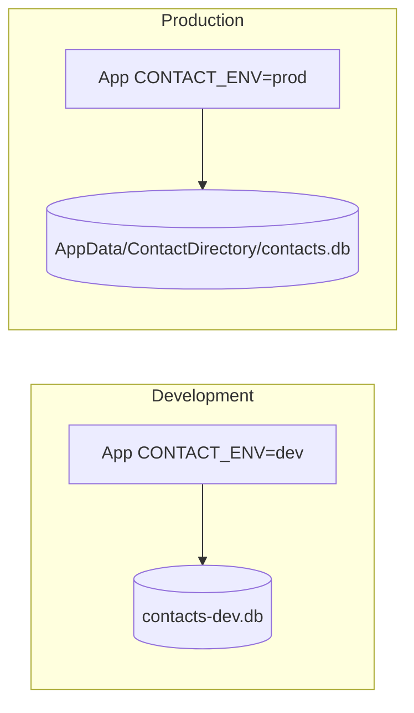

# Development and Production Environments

This application is a **desktop** program (not a web server). Dev and prod environments separate **configuration**, **data files**, and **release artifacts** so development never overwrites real user contacts.

---

## 1. Environment overview

| Aspect | Development (`dev`) | Production (`prod`) |
|--------|---------------------|---------------------|
| **Purpose** | Daily coding, testing, experiments | End-user installs and live data |
| **Database file** | `contacts-dev.db` (project folder) | `%LOCALAPPDATA%\ContactDirectory\contacts.db` (Windows) |
| **Legacy import file** | `contacts-dev.txt` | `contacts.txt` (working directory) |
| **Window title** | Personal Contact Directory **(DEV)** | Personal Contact Directory |
| **Logging** | `INFO` | `WARNING` |
| **Default when unset** | Yes | No — must be selected explicitly |



---

## 2. How the environment is selected

Priority (first match wins):

1. JVM system property: `-Dcontact.env=prod`
2. OS environment variable: `CONTACT_ENV=prod`
3. Default: `dev`

### Windows scripts

```bat
run-dev.bat    REM sets CONTACT_ENV=dev
run-prod.bat   REM sets CONTACT_ENV=prod
run.bat        REM uses dev if CONTACT_ENV is not set
```

### Maven

```bash
mvn compile -Pdev
mvn exec:java -Pdev

mvn package -Pprod
mvn exec:java -Pprod
```

### Manual Java

```bash
java -Dcontact.env=prod -cp "out;lib\sqlite-jdbc.jar" ContactDirectoryApp
```

---

## 3. Configuration files

| File | Purpose |
|------|---------|
| `config/application-dev.properties` | Development settings |
| `config/application-prod.properties` | Production settings |

Loaded from:

1. Classpath: `/config/application-{env}.properties` (bundled in JAR or `out/config/` after compile)
2. File override: `config/application-{env}.properties` in the working directory (overrides classpath)

### Key properties

| Property | Description |
|----------|-------------|
| `environment` | `development` or `production` (informational) |
| `database.file` | SQLite path; optional in prod (uses AppData default) |
| `legacy.file` | Pipe-delimited text file for one-time migration |
| `window.title` | Frame title shown in the GUI |
| `logging.level` | `java.util.logging` level (`INFO`, `WARNING`, etc.) |

Implementation class: `AppEnvironment.java`.

---

## 4. Branch and release strategy (recommended)

| Branch | Environment | Usage |
|--------|-------------|--------|
| `develop` | Development | Feature work, integration |
| `main` | Production | Stable releases only |
| Tags `v*` | Production release | CI builds installer/JAR |

**Workflow**

1. Develop on `develop` → run with `run-dev.bat`.
2. Merge to `main` via pull request after review and CI pass.
3. Tag `v1.1.0` on `main` → CI produces release artifact.
4. Distribute production JAR/installer; users run with `CONTACT_ENV=prod` (embedded in `run-prod.bat`).

---

## 5. Promoting to production

### Checklist before a production release

- [ ] All manual tests in `docs/TEST_CASES.md` passed on `prod` profile
- [ ] `contacts-dev.db` not packaged in release
- [ ] Version updated in `pom.xml`
- [ ] CI green on `main`
- [ ] Release notes written

### Build production artifact

```bash
mvn clean package -Pprod
```

Output: `target/contact-directory-1.0.0.jar` (fat JAR with dependencies).

Ship with `run-prod.bat` (or installer) that sets `CONTACT_ENV=prod`.

### User data location (production)

Windows:

```
%LOCALAPPDATA%\ContactDirectory\contacts.db
```

Example:

```
C:\Users\<you>\AppData\Local\ContactDirectory\contacts.db
```

The directory is created automatically on first run.

---

## 6. What not to commit

| File | Reason |
|------|--------|
| `contacts.db` | Production-like data in repo folder |
| `contacts-dev.db` | Developer test data |
| `*.bak` | Migrated legacy backups |

These are listed in `.gitignore`.

---

## 7. Related documents

| Document | Topic |
|----------|--------|
| [CICD_OPTIONS.md](CICD_OPTIONS.md) | CI/CD platform comparison and pipelines |
| [PROJECT_DESIGN.md](PROJECT_DESIGN.md) | Application architecture |
| [TEST_CASES.md](TEST_CASES.md) | Manual test cases per environment |
