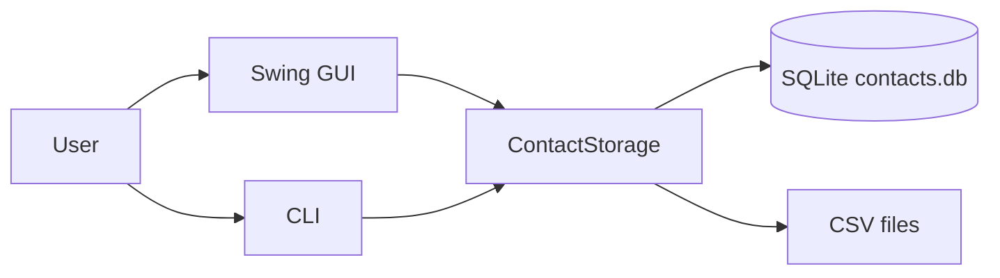
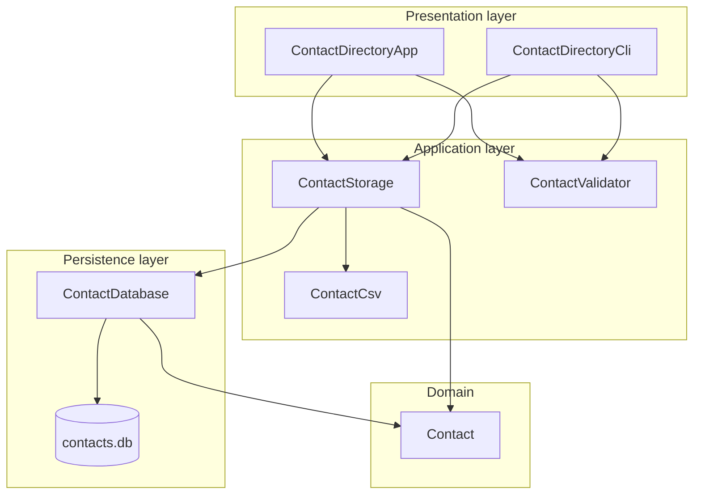
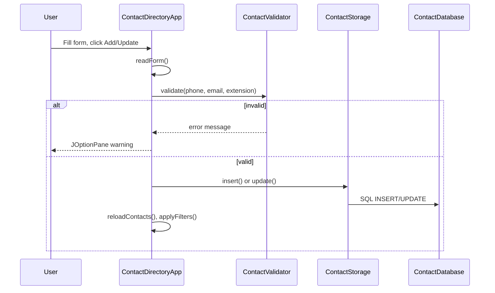

# Personal Contact Directory — Project Design Document

**Version:** 1.1  
**Last updated:** May 2026  
**Technology stack:** Java 17, Swing, SQLite (JDBC)

---

## 1. Purpose and scope

The Personal Contact Directory is a desktop application for storing and managing personal and work contacts. Users can add, update, search, filter, sort, import, and export contacts. Data persists in a local SQLite database file (`contacts.db`).

**In scope**

- CRUD operations for contacts (GUI and optional CLI)
- Group classification (Work, Family, Friends)
- Search, filter, and sort in the GUI
- CSV import and export
- Input validation for phone, email, and extension
- Automatic schema migration and legacy text-file import

**Out of scope**

- Multi-user or network synchronization
- Authentication or encryption
- Cloud backup
- Automated unit/integration test suite (manual test cases are documented separately)

---

## 2. System context



| Actor / system | Interaction |
|----------------|-------------|
| User | Uses GUI (`run.bat`) or CLI (`--cli`) |
| SQLite file | Local persistence; created on first run |
| CSV files | Import source / export destination |

---

## 3. Architecture

The application follows a **layered architecture** with a thin domain model and no external framework beyond JDBC and Swing.



### 3.1 Layer responsibilities

| Layer | Class(es) | Responsibility |
|-------|-----------|----------------|
| **Domain** | `Contact` | Plain data object: id, name, phone, email, group, department, organization, extension |
| **Persistence** | `ContactDatabase` | JDBC access, schema creation, column migration, legacy `.txt` import |
| **Application** | `ContactStorage` | Public API for load/insert/update and CSV import/export |
| **Application** | `ContactValidator` | Phone, email, and extension validation rules |
| **Application** | `ContactCsv` | RFC-style CSV parse/serialize and header mapping |
| **Presentation** | `ContactDirectoryApp` | Swing UI: form, table, filter, sort, search, import/export dialogs |
| **Presentation** | `ContactDirectoryCli` | Console menu for view, add, search |

### 3.2 Design principles

- **Single database file** — No server process; suitable for single-user desktop use.
- **Facade pattern** — `ContactStorage` hides JDBC and initialization from the UI.
- **Backward compatibility** — `ALTER TABLE` migrations for existing databases; CSV and legacy 4-column format supported on import.
- **Fail-safe validation** — Invalid rows on CSV import are skipped with a summary; GUI blocks save on validation errors.

---

## 4. Data model

### 4.1 Entity: Contact

| Field | Type | Required | Notes |
|-------|------|----------|-------|
| `id` | INTEGER | Auto | Primary key |
| `name` | TEXT | Yes | Non-empty for save/import |
| `phone` | TEXT | No | Digits and `+ - ( ) .` space only when non-empty |
| `email` | TEXT | No | Must contain `@` when non-empty |
| `group_name` | TEXT | Yes | One of: Work, Family, Friends (default: Friends) |
| `department` | TEXT | No | Free text |
| `organization` | TEXT | No | Free text |
| `phone_extension` | TEXT | No | Stored as `extension` in Java; digits, `x`, `#`, etc. |

### 4.2 Database schema

```sql
CREATE TABLE contacts (
    id INTEGER PRIMARY KEY AUTOINCREMENT,
    name TEXT NOT NULL,
    phone TEXT NOT NULL DEFAULT '',
    email TEXT NOT NULL DEFAULT '',
    group_name TEXT NOT NULL DEFAULT 'Friends',
    department TEXT NOT NULL DEFAULT '',
    organization TEXT NOT NULL DEFAULT '',
    phone_extension TEXT NOT NULL DEFAULT ''
);
```

**Migration:** On startup, `ContactDatabase.migrateSchema()` inspects `PRAGMA table_info(contacts)` and adds missing columns (`department`, `organization`, `phone_extension`) for databases created before v1.1.

**Legacy import:** If `contacts.txt` exists and the table is empty, pipe-delimited lines (`name|phone|email|group`) are imported once and the file is renamed to `contacts.txt.bak`.

### 4.3 CSV format

**Export / full import header:**

`Name, Phone, Extension, Email, Department, Organization, Group`

**Legacy import (no header):** 4 columns — Name, Phone, Email, Group.

Import detects a header row when the first column normalizes to `name`. Column headers are matched case-insensitively with spaces/underscores removed (e.g. `Telephone Extension` → `telephoneextension`).

---

## 5. Key workflows

### 5.1 Application startup

1. `ContactDirectoryApp` constructor runs.
2. `ContactStorage.load()` → `ContactDatabase.initialize()` → create/migrate schema, optional legacy `.txt` migration.
3. Contacts loaded into memory list; GUI built; table populated via `applyFilters()`.

### 5.2 Add / update contact (GUI)



- **Add:** `editingId == null` → `INSERT`.
- **Update:** Double-click row sets `editingId` → `UPDATE` by id.

### 5.3 Display pipeline (filter + search + sort)

1. `buildDisplayedList()` filters by group combo and optional name substring in search field.
2. `sortContacts()` applies selected comparator (name, group, email, phone, department, organization).
3. `refreshTable()` maps contacts to table rows and parallel `displayedIds` list for double-click edit.

### 5.4 CSV import

1. User selects file via `JFileChooser`.
2. `ContactCsv.parseFile()` returns `ParsedRow` list (line number + `Contact`).
3. For each row: skip if name empty or validation fails; else `ContactStorage.insert()`.
4. `ImportResult` reports imported count, skipped count, and up to 8 error lines in a dialog.

### 5.5 CSV export

1. Requires at least one contact in memory.
2. Writes header + one row per contact via `ContactCsv.toRow()`.

---

## 6. User interface design

### 6.1 Layout

| Region | Size / behavior | Contents |
|--------|-----------------|----------|
| Window | Default 980×560, minimum 800×480 | Title: Personal Contact Directory |
| West | Scrollable sidebar ~250px | Contact form, filter, sort, search, Import/Export |
| Center | Remaining width | Scrollable table, 7 columns |

### 6.2 Table columns

Name, Phone, Ext., Email, Department, Organization, Group

### 6.3 Sidebar controls

- **Contact Details:** Name, Phone, Extension, Email, Department, Organization, Group, Add/Update, Clear
- **Filter by Group:** All | Work | Family | Friends
- **Sort by:** Name (A-Z/Z-A), Group (A-Z/Z-A), Email, Phone, Department, Organization
- **Search:** text field, Find, Show All
- **Import CSV / Export CSV**

### 6.4 CLI

Menu options: (1) View all, (2) Add, (3) Search by name, (4) Exit. Same validation rules as GUI for add.

---

## 7. Validation rules

| Field | Rule |
|-------|------|
| Name | Required on save and import |
| Phone | No letters; if non-empty, only `[0-9+\\-().\\s]` |
| Email | If non-empty, must contain `@` |
| Extension | If non-empty, only `[0-9+#xX\\-.\\s]` |
| Group | Must be Work, Family, or Friends; invalid CSV values default to Friends |

---

## 8. Dependencies and deployment

| Dependency | Version | Purpose |
|------------|---------|---------|
| JDK | 17+ | Language and Swing |
| sqlite-jdbc | 3.34.0 | SQLite driver (Maven or `lib/sqlite-jdbc.jar`) |

**Build paths**

- **Windows scripts:** `compile.bat` downloads JDBC if missing, compiles `src/*.java` to `out/`, `run.bat` launches GUI.
- **Maven:** `mvn compile`, `mvn exec:java`, optional shaded JAR via `mvn package`.

**Runtime artifacts**

- `contacts.db` — created in working directory
- `contacts.txt.bak` — optional after legacy migration

---

## 9. Error handling

| Scenario | Behavior |
|----------|----------|
| DB load failure on startup | Error dialog; empty contact list |
| Save/update SQLException | Error dialog; form retained |
| Import IO/SQL error | Error dialog; no partial reload message beyond per-row skip |
| Export with no contacts | Information dialog |
| Search with empty query | Warning to enter a name |
| Missing SQLite JAR | `ExceptionInInitializerError` with setup instructions |

---

## 10. Security and privacy considerations

- All data is stored **locally**; no transmission to remote services.
- CSV import/export can expose personal data on disk; users choose file paths.
- No sanitization beyond validation; SQL uses prepared statements to mitigate injection.

---

## 11. Future enhancements (optional)

- Delete contact action
- Duplicate detection on import
- JUnit tests for `ContactValidator` and `ContactCsv`
- Search across email, department, and organization
- Configurable contact groups

---

## 12. Environments and deployment

| Environment | Selector | Database |
|-------------|----------|----------|
| Development | `CONTACT_ENV=dev` (default) | `contacts-dev.db` |
| Production | `CONTACT_ENV=prod` | `%LOCALAPPDATA%\ContactDirectory\contacts.db` |

Configuration is loaded by `AppEnvironment` from `config/application-{env}.properties`. See `docs/ENVIRONMENTS.md` and `docs/CICD_OPTIONS.md`.

---

## 13. Document references

| Document | Location |
|----------|----------|
| User guide / quick start | `README.md` |
| Test cases | `docs/TEST_CASES.md` |
| Dev / prod environments | `docs/ENVIRONMENTS.md` |
| CI/CD options | `docs/CICD_OPTIONS.md` |
